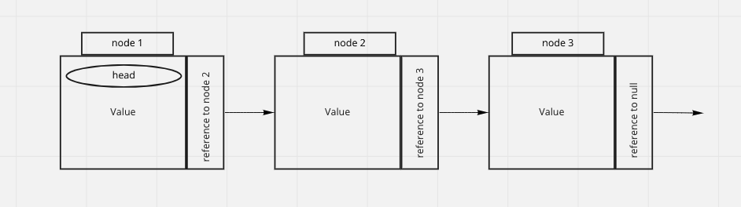

# Linked Lists and you
## How to know where you are in a linked list
## In this phaplet you will:

## [Big 0: Analysis of Alforithm Efficiency](https://codefellows.github.io/common_curriculum/data_structures_and_algorithms/Code_401/class-05/resources/big_oh.html)
### Big(O)
  - helps describe the efficiency of an algorithm or function
  - running time:
    - amount of time need to execute a function
  - memory space:
    - amount of memory resources need for the function

### 4 Key Areas of analysis:
  1. Input Size
  2. Units of Measurement
  3. Orders of Growth
  4. Best Case, Worst Case, and Average Case


1. ### Input Size
- n denotes input
- it also matters the size of each input as well
- a larger n will likely increase running time and memory space
2. ### Units of Measurement
- Running time
  - Milliseconds
    - physical amount of time that passes to run the test
  - number of operations
    - the total lines of code that are executed start to finish
  - Basic Operations
    - the operation that is contributing the most to the total run time
- Memory Space
  - space needed to hold the code for the algorithm
    - the amount of bytes needed to store the characters
  - space needed to hold the input data
    - what ever is need to be manipulated
  - space needed to hold the output data
  - space needed to hold the working space during the run of the function
    - all of the additional variable and references the code will make during the run
3. ### Orders of Growth
- Describes the growth of running time and memory space in relation to `n`(inputs)
- Constant Complextiy
  - this function does not have an increase of running time and memory space in relation to inputs
  - O(1)
- Logarithmic Complexity
  - this function has strong relation in increase of running time and memory space at the beginning but decreases as more inputs are added
  - O(logN)
- Linear Complexity
 - this function has a direct relation in increase of running time and memory space as inputs are added
 - O(N)
- Linearithmic Complexity
 - this function has a slightly stronger that direct relation in increase of running time and memory space as inputs are add
 - O(NlogN)
- Quadratic Complexity
  - this function has a squaring of running time and memory space as the amount of inputs is increased
  - O(N^2)
- Cubic Complexity
  - this function has a cubing of running time and memory space as the amount of inputs is increased
  - O(N^3)
- Exponential Complexity
  - this functions running time and memory space grow at the rate of two to the power of inputs
  - O(2^N)
- Factorial Complexity
  - this functions funning time and memory space grow as a factorial quantity of inputs
  - O(N!)
4. ### Worst Case, Best Case, Average Case
- Worst Case
  - is everything that can take longer does
  - Big O(oh)
- Best Case
  - Everything is in the first position and takes the least amount of time
  - Big Omega
- Average Case
  - an assumption of what possible n values will be and seeing how the different n values will affect efficiency
  - Big Theta

## [Linked Lists](https://codefellows.github.io/common_curriculum/data_structures_and_algorithms/Code_401/class-05/resources/singly_linked_list.html)
- What is a Linked List
  - a sequence of nodes that are connected/ lined to each other.
- TRAVERSAL
  - Usually within a while loop
    - allows to check that the `Next` node is not null
    - `Current` tells us where in the linked list
- Pseudo-code to see if a value is in our linked list
```python
def Includes(value)

  Current = Head

  While Current is not NULL
    if Current.Value is equal to value
      return true
  
    Current = Current.Next

  return false
```
- Pseudo-code to add a node to the head of the linked list
```python
def AddNodetoFront(value)

  newNode = New Node
  newNode.value = value
  newNode.next = Head
  Head = newNode

```

- Pseudo-code to add a node to the middle of the linked list
```python
def AddBefore(value, valueToAddBefore)

  Current = head

  while Current.Next is not NULL
    if Current.Next.Value == valueToAddBefore
      newNode = New Node
      newNode = value
      newNode.Next = Current.Next
      Current.Next = newNode
      return true

  Current = Current.Next

  return false

```
- Pseudo-code to print out all the values of the linked list
```python
def printList(

  Current = head

  while Current is not NULL
   print(Current.value)
   Current = Current.Next

  return false

```

## [Whats a linked List pt. 1](https://medium.com/basecs/whats-a-linked-list-anyway-part-1-d8b7e6508b9d)
## [Whats a linked List pt. 2](https://medium.com/basecs/whats-a-linked-list-anyway-part-2-131d96f71996)

- Linked Lists
  - dynamic storage as compared to static
    - static
      - e.g. a list/array needs the data store next to each other
    - dynamic
      - e.g. linked list can be stored anywhere as individual parts because each `node` references the next `node`
  - Structure of a linked list 
    - Head is not a property of the first node
      it is a reference that is mutable and will need to be changed if you add to the front of the list
  
  - Singly and Doubly
    - singly
      - only has a reference to its following `node`
    - doubly
      - has a reference to the following `node` and the preceding `node` 

[Return to Home](reading-05.md)