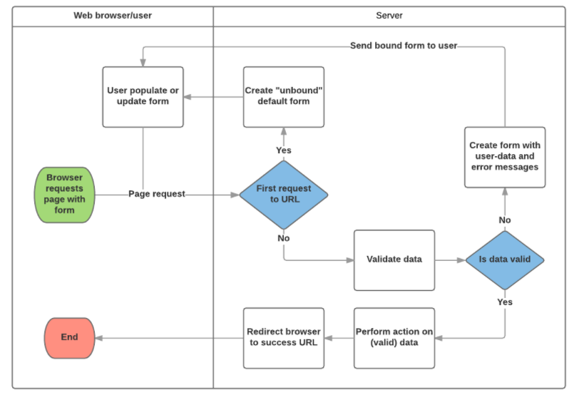

# Forms
## FORMS
### FORMSFORMSFROMSFORMS

## [Django Forms](https://developer.mozilla.org/en-US/docs/Learn/Server-side/Django/Forms)
- Forms is a way for end users to give input
  - Often this will create a entry into the data base

### The HTML Form
``` html
<form action= "/what_smell_is_it/" method = "post">
  <label for = "which_smell">Enter Smell: </label>
  <input id = "which_smell" type ="tex" name ="smell_field" value ="bad">
  <input type ="submit" value ="post smell">
</from>
```
  - `action`
    - resource/URL where data is to be sent for processing when the form is submitted
  - `method`
    - this will be either a post or a get
      - post if you are adding data to the database
      - get is if this field requests something from a URI



- This is a simple flow chart ot decribe the a form being requested and then sent to the database plus data validation

### Django Form Class
``` python
from django import forms

class DefineSmellForm(forms.Form):
  what_soes_it_smell_like = forms.CharField(help_text = "Talk about what it made you think or")
```
- The Form class is the heart of the form experience for django

### Validation
``` python
def clean_what_does_it_smell_like(self):
  data = self.cleaned_data['what_does_it_smell_like']

  return data
```
- Modifying the `clean` of a field is a method on the Form class
- you will gather the data `self.cleaned_data['what_does_it_smell_like']`
- make sure to return this data at the end of the method to allow the rest of the built in validations to take place

[Return to Home](README.md)