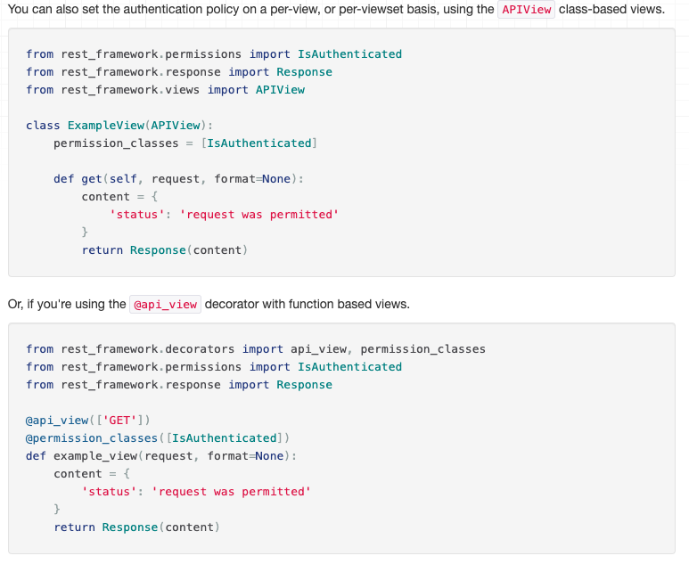

## Permissions & Postgresql

### [DRF Permission](https://www.django-rest-framework.org/api-guide/permissions/)
- Permissions
  - This is the gatekeeping that keeps users from specific access within a website
  - They are checked first before a view is displayed to see if that user has access to that page

- What happens when you run a check
  - either `exceptions.PermissionDenied` or `exceptions.NotAuthenticated` is raised if the user fails
    - these generate either a status code 403 or 41

- There is also object level permissions
  - specific acts can be permission protected

- Recommend to open page for continued reference sheet to specific permissions

Resources:
- [Classy Django Rest](https://www.cdrf.co/)
- [Django Rest Framework Generic Views](https://www.django-rest-framework.org/api-guide/generic-views/)
[Return to Home](README.md)

